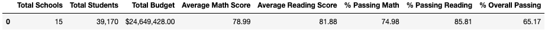
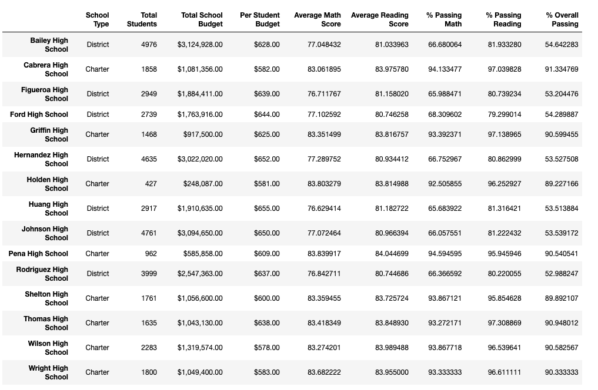

# Pandas Challenge 

## PyCity Schools Analysis

### Trends

* Looking into the data is possible to see that the Top 5 - Highest-Performing Schools are School type Charter.
* The Scores by School Type Data shows us that the overall passing rate is higher in Charter schools (90.43%) than in District schools (53.67%).
* Scores by School Size Data is showing us that large schools have a overall passing rate lower than small schools.

## Background

You are the new Chief Data Scientist for your city's school district. In this capacity, you'll be helping the school board and mayor make strategic decisions regarding future school budgets and priorities.

As a first task, you've been asked to analyze the district-wide standardized test results. You'll be given access to every student's math and reading scores, as well as various information on the schools they attend. Your task is to aggregate the data to showcase obvious trends in school performance.

## District Summary

Perform the necessary calculations and then create a high-level snapshot of the district's key metrics in a DataFrame.

Include the following:
* Total number of unique schools
* Total students
* Total budget
* Average math score
* Average reading score
* % passing math (the percentage of students who passed math)
* % passing reading (the percentage of students who passed reading)
* % overall passing (the percentage of students who passed math AND reading)

### Solution

## School Summary

Perform the necessary calculations and then create a DataFrame that summarizes key metrics about each school.

Include the following:

* School name
* School type
* Total students
* Total school budget
* Per student budget
* Average math score
* Average reading score
* % passing math (the percentage of students who passed math)
* % passing reading (the percentage of students who passed reading)
* % overall passing (the percentage of students who passed math AND reading)

### Solution

## Highest-Performing Schools (by % Overall Passing)

Sort the schools by % Overall Passing in descending order and display the top 5 rows.

### Solution

## Lowest-Performing Schools (by % Overall Passing)

Sort the schools by % Overall Passing in ascending order and display the top 5 rows.

### Solution

## Math Scores by Grade

Perform the necessary calculations to create a DataFrame that lists the average math score for students of each grade level (9th, 10th, 11th, 12th) at each school.

### Solution

## Reading Scores by Grade

Create a DataFrame that lists the average reading score for students of each grade level (9th, 10th, 11th, 12th) at each school.

### Solution

## Scores by School Spending

Create a table that breaks down school performance based on average spending ranges (per student).

Include the following metrics in the table:

* Average math score
* Average reading score
* % passing math (the percentage of students who passed math)
* % passing reading (the percentage of students who passed reading)
* % overall passing (the percentage of students who passed math AND reading)

### Solution

## Scores by School Size

Create a DataFrame called size_summary that breaks down school performance based on school size (small, medium, or large).

### Solution

## Scores by School Type

This new DataFrame should show school performance based on the "School Type".

### Solution

